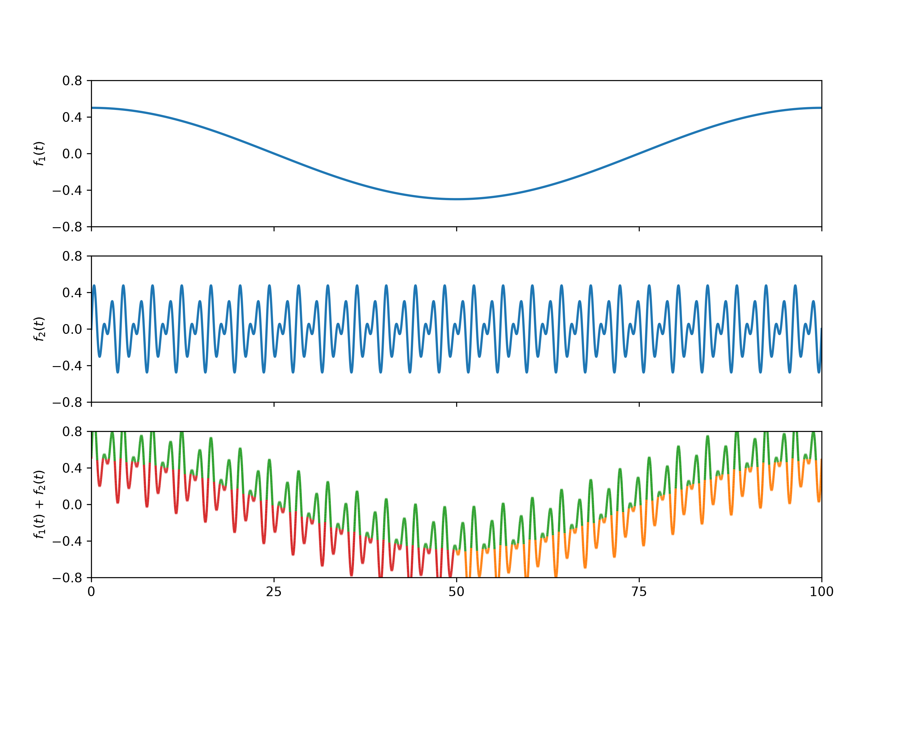
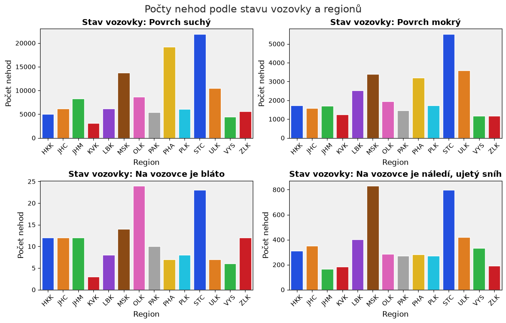
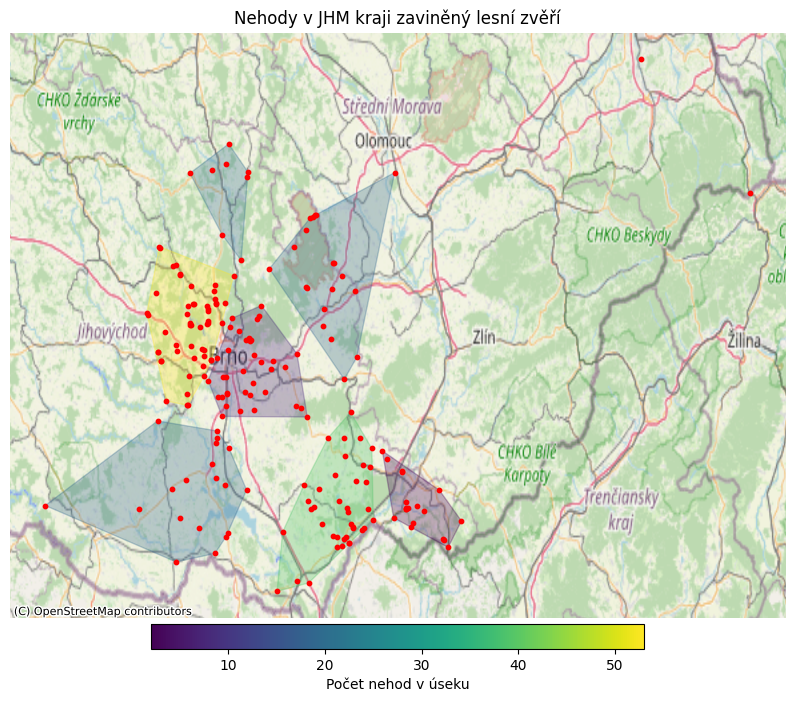

# Traffic Accident Analysis

A university project focused on data processing, visualization, geospatial
analysis and statistical evaluation of traffic accident data in the Czech Republic.

The project was developed as part of the course
**Data Analysis and Visualization in Python** at Brno University of Technology.

The repository contains three consecutive project stages, progressing from
basic numerical processing and visualization to advanced geospatial and
statistical analysis.

## Technologies

- Python
- NumPy
- Pandas
- Matplotlib
- Seaborn
- BeautifulSoup
- Requests
- GeoPandas
- Shapely
- Contextily
- scikit-learn
- SciPy
- Jupyter Notebook
- pytest

## Project Structure

### Part 1 – NumPy, Visualization and Web Scraping

The first part focuses on fundamental data processing and visualization tasks.

Main topics:

- vectorized numerical computations using NumPy
- NumPy broadcasting
- visualization with Matplotlib
- advanced multi-panel plots
- downloading and parsing HTML data
- web scraping using Requests and BeautifulSoup
- automated testing with pytest

The project also downloads and parses meteorological station data including
station names, geographic coordinates and elevation.

### Part 2 – Traffic Accident Data Analysis

The second part introduces data analysis using Pandas and Seaborn.

Main tasks include:

- loading data directly from a ZIP archive
- processing HTML-based XLS files
- data cleaning and transformation
- duplicate removal
- regional classification
- data aggregation using Pandas
- visualization of road conditions
- analysis of alcohol-related accidents
- time-series visualization of accident types

### Final Project – Geospatial and Statistical Analysis

The final part extends the project with advanced data analysis techniques.

It includes:

- creation and processing of GeoDataFrames
- coordinate reference system transformations
- accident visualization on OpenStreetMap backgrounds
- geographic filtering and spatial analysis
- KMeans clustering of accident locations
- convex hull visualization of accident clusters
- seasonal weather analysis
- automatic generation of analytical outputs
- statistical hypothesis testing in Jupyter Notebook

The statistical analysis includes:

- Chi-square test
- Shapiro-Wilk normality test
- Mann-Whitney U test

## Example Outputs

### Part 1 – NumPy and Matplotlib

### Part 2 – Traffic Accident Analysis

### Final Project – Geospatial Analysis

